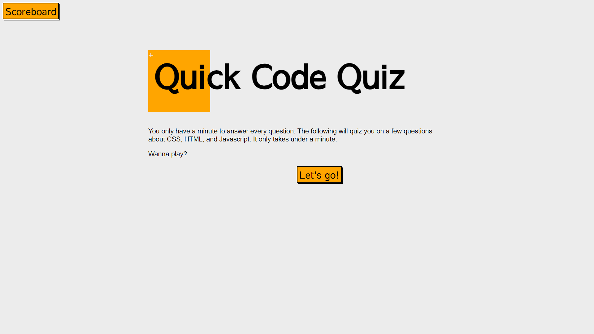

# HTML, CSS, Javascript -- Code Quiz

For the fourth week, we were tasked with using our newer Javascript knowledge and combining that with our HTML and CSS skills. The final result was to create a one-page application that consisted of a timed quiz with multiple choice answers plus a leaderboard.

## About the Project

[Code Quiz](https://pldbrja.github.io/quality-code-quiz/)

The quiz itself is a mixture of HTML and Javascript inserting the questions as the user answers and continues to the next screen.

If it had worked properly, the game would've included a question that would've been pushed into the H2 element on the screen that appears after starting the game. The answers would have been listed below in the corresponding LI elements, but due to an assortment of issues that came with attempting to troubleshoot certain elements, there are several pieces to this assignment that did not reach the current state of the application.

Within the code are comments identifying the parts of the code that had the issues, and what occurred that caused it to become as buggy as it was.

In the end, the greatest struggle was the attempt to freehand a majority of the code while taking pointers from a variety of sites. Although the final project is not up to what was requested in the user story, it will not be the last time this project was worked on. There will be updates in the future to return and fix the issues in the page.

## Screenshots

